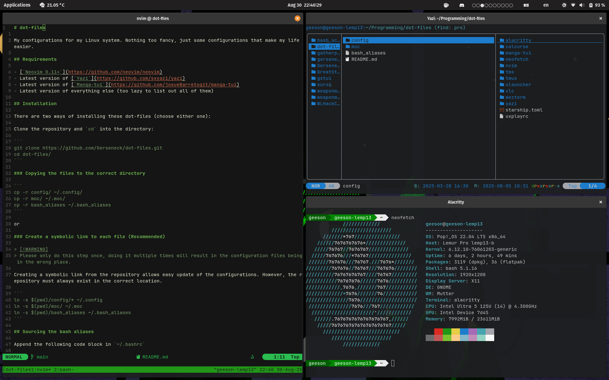

# dot-files

My configurations for my Linux system. Nothing too fancy, just some configurations that make my life easier.

## Screenshots



## Requirements

- [`Neovim 0.11+`](https://github.com/neovim/neovim)
- [`JetBrains Mono Nerd Font`](https://github.com/ryanoasis/nerd-fonts)
- Latest version of [`Yazi`](https://github.com/sxyazi/yazi)
- Latest version of [`Manga-tui`](https://github.com/josueBarretogit/manga-tui)
- Latest version of everything else (too lazy to list out all of them)

## Installation

There are two ways of installing these dot-files (choose either one):

Clone the repository and `cd` into the directory:

```
git clone https://github.com/Gerseneck/dot-files.git
cd dot-files/
git submodule update --init --recursive
```

### Copying the files to the correct directory (One Time Installation, No Updates)

```
cp -r config/ ~/.config/
cp -r moc/ ~/.moc/
cp -r bash_aliases ~/.bash_aliases
```

or

### Create a symbolic link to each file (Recommended)

Creating a symbolic link from the repository allows easy update of the configurations. However, the repository must always exist in the correct location.

```
ln -sfn $(pwd)/config/* ~/.config
ln -sfn $(pwd)/moc/ ~/.moc
ln -sfn $(pwd)/bash_aliases ~/.bash_aliases
```

## Sourcing the bash aliases

Append the following code block in `~/.bashrc`

```bash
if [ -f ~/.bash_aliases ]; then
    . ~/.bash_aliases
fi
```

## Installing plugins for Yazi

to install plugins defined in `config/yazi/package.toml`, run

```
ya pkg install
```
